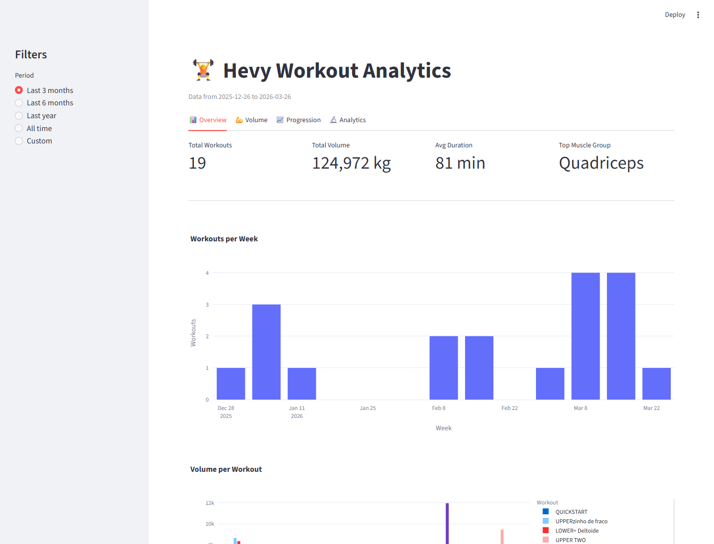

# Hevy Workout ETL Pipeline

[](https://github.com/J0BS013/hevy-workout-etl-pipeline/actions/workflows/ci.yml)



The dashboard turns the pipeline outputs into workout-frequency, training-volume, exercise-progression, personal-record, and statistical-trend views. It reads the Gold and Analytics Parquet tables rather than calling the API directly.

An end-to-end data engineering project that extracts workout data from the **Hevy API**, processes it through a **Medallion Architecture** (Bronze → Silver → Gold → Analytics), and delivers insights via an interactive **Streamlit dashboard** with statistical analysis.

---

## Architecture

```
Hevy API
   │
   ▼
Bronze Layer      Raw API data with full pagination (Parquet)
   │
   ▼
Silver Layer      Flattened: one row per set, typed columns (Parquet)
   │
   ▼
Gold Layer        Aggregated tables ready for visualization (Parquet)
   │
   ▼
Analytics Layer   Statistical models: OLS regression, PRs, consistency (Parquet)
   │
   ▼
Streamlit App     Interactive dashboard with 4 tabs
```

---

## Features

**Pipeline**
- Full pagination support — fetches all API pages automatically
- Medallion Architecture with clear separation of concerns
- Parquet-only storage for performance and type safety
- Structured logging across all pipeline stages

**Analytics (scipy)**
- Linear regression on strength progression per exercise (slope, R², p-value)
- Statistical significance testing (p < 0.05 threshold)
- Volume trend analysis with OLS regression line
- Personal Record detection
- Consistency score based on coefficient of variation

**Streamlit Dashboard**
- Period filters: Last 3 months / 6 months / Last year / All time / Custom
- **Overview** — KPIs, workout frequency, volume per session
- **Volume** — Weekly stacked bar by muscle group + radar chart distribution
- **Progression** — Weight progression + session volume per exercise
- **Analytics** — Regression insights, PR timeline, trend visualization

**Data Quality**
- Automated checks between every pipeline layer (Bronze → Silver → Gold)
- Validates schema, nulls, negative values and duplicate keys
- Raises `DataQualityError` with a clear message before bad data propagates

**Tests**
- 56 automated tests with `pytest`, zero external dependencies (no API calls)
- Shared fixtures in `conftest.py` covering raw API payloads → Silver → Gold
- Full coverage of transform, aggregation and statistical functions

---

## Project Structure

```
hevy-workout-etl-pipeline/
│
├── pipeline/
│   ├── bronze/
│   │   └── extract.py          # Paginated API extraction
│   ├── silver/
│   │   └── transform.py        # Flatten workouts → one row per set
│   ├── gold/
│   │   └── aggregate.py        # Workout summary, weekly volume, progression
│   ├── analytics/
│   │   └── stats.py            # OLS regression, PRs, consistency score
│   └── quality/
│       └── checks.py           # Data quality checks per layer
│
├── utils/
│   └── storage.py              # save_to_parquet
│
├── data/
│   ├── bronze/                 # Raw API records
│   ├── silver/                 # Cleaned and flattened
│   ├── gold/                   # Aggregated analytics tables
│   └── analytics/              # Statistical model outputs
│
├── tests/
│   ├── conftest.py             # Shared fixtures (raw → silver → gold)
│   ├── test_extract.py         # retries, pagination and atomic writes
│   ├── test_transform.py       # Silver-layer transforms
│   ├── test_aggregate.py       # Gold-layer aggregations
│   └── test_stats.py           # Analytics calculations
│
├── config.py                   # API config and path definitions
├── main.py                     # Pipeline orchestrator
├── app.py                      # Streamlit dashboard
└── requirements.txt
```

---

## Gold Tables

| Table | Description |
|---|---|
| `workout_summary` | Volume, sets and exercises per workout |
| `weekly_volume` | Volume per ISO week per muscle group |
| `exercise_progression` | Max weight and volume per exercise per session |
| `muscle_group_summary` | Aggregated volume per primary muscle group |

## Analytics Tables

| Table | Description |
|---|---|
| `exercise_stats` | OLS slope (kg/week), R², p-value and trend per exercise |
| `personal_records` | Every session where a new PR was set |
| `volume_trend` | Weekly volume regression with significance test |
| `consistency` | CV-based consistency score and longest streak |

---

## Requirements

- Python 3.10+
- Hevy API Key — get yours at [hevyapp.com](https://www.hevyapp.com/)

---

## Setup

**1. Clone the repository**
```bash
git clone https://github.com/J0BS013/hevy-workout-etl-pipeline.git
cd hevy-workout-etl-pipeline
```

**2. Install dependencies**
```bash
pip install -r requirements.txt
```

**3. Configure API key**

Create a `.env` file in the root directory:
```env
HEVY_API_KEY=your_api_key_here
```

---

## How to Run

**Run the full pipeline**
```bash
python main.py
```

**Launch the dashboard**
```bash
streamlit run app.py
```

The dashboard opens automatically at `http://localhost:8501`.

The repository includes a versioned portfolio dataset in the Gold and Analytics layers, so the dashboard works immediately after dependency installation. Run `main.py` first only when replacing that sample with a fresh extraction from your own Hevy account.

**Run the test suite**
```bash
pytest tests/ -v
```

56 tests, no API calls required.

GitHub Actions runs this API-free suite on pushes and pull requests.

### API failure and recovery behavior

Each required API page has a 15-second timeout. Only transient failures (HTTP 429/5xx and request timeouts) are retried with exponential backoff; authentication and other non-recoverable errors fail immediately. Extraction returns data only after all advertised pages succeed, so partial data is never saved as a successful Bronze snapshot. Re-run `python main.py` after resolving the API issue; Parquet promotion is atomic, preserving the previous file if a write fails.

---

## Tech Stack

| Layer | Technology |
|---|---|
| Data extraction | `requests`, Hevy REST API |
| Data processing | `pandas` |
| Storage | `parquet` (via `pyarrow`) |
| Statistical analysis | `scipy` (OLS regression, hypothesis testing) |
| Visualization | `streamlit`, `plotly` |
| Config management | `python-dotenv` |
| Testing | `pytest` |
| Data quality | Custom validation layer |

---
